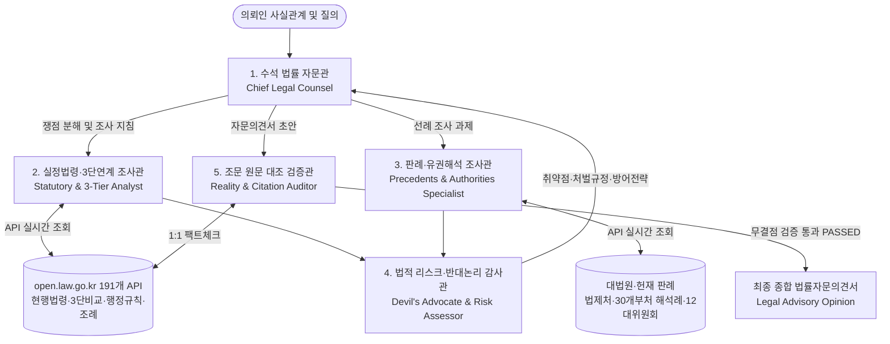

# law-skill: 대한민국 법제처 OpenAPI 기반 5인 전문 법률 검토 에이전트 팀

대한민국 법제처 국가법령정보 공동활용(`https://open.law.go.kr`)의 191개 공공 법률 API 엔드포인트를 실시간 연동하여, 가짜 조문이나 왜곡된 판례 인용을 원천 차단(Zero-Hallucination Gate)하고 최고 수준의 법률 검토 및 자문의견서(Legal Opinion)를 생성하는 에이전트 팀 스킬입니다.

---

## 🏛️ 5인 전문 법률 에이전트 팀 아키텍처



### 5인 역할 분업:
1. **🏛️ 수석 법률 자문관 (Chief Legal Counsel)**: 사실관계 심층 분석, 2~4대 핵심 법률 쟁점 도출, 최종 FIRAC 의견서 총괄 집필.
2. **📜 실정법령·3단연계 조사관 (Statutory & 3-Tier Analyst)**: 현행법령(`eflaw`), 공포법령, 법률-시행령-시행규칙 3단 비교(`thdCmp`), 행정규칙/조례 실시간 탐색.
3. **⚖️ 판례·유권해석 조사관 (Precedent Specialist)**: 대법원 판례(`prec`), 헌재 결정례(`detc`), 법제처 유권해석례(`expc`), 12대 전문 위원회 결정문 수집.
4. **😈 법적 리스크·반대논리 감사관 (Devil's Advocate)**: 보수적 시각에서 의뢰인의 법적 취약점 공격, 처벌 규정(징역·벌금·과태료) 및 입증책임 분석, 상대방 반대 논리 선제 방어.
5. **🛡️ 조문 원문 대조 검증관 (Reality & Citation Auditor)**: Zero-Hallucination Gatekeeper. 문서 내 인용된 모든 조문과 사건번호를 open.law.go.kr API와 1:1 전수 실시간 대조.

---

## ⚡ 빠른 시작 (CLI)

```powershell
# 1. 5인 에이전트 팀 법률 검토 및 자문의견서 원스톱 생성
python scripts/law_cli.py review "직원 동의 없는 사무실 CCTV 설치 및 근태관리 활용 적법성 검토" -o "legal_cctv_opinion.md"

# 2. 특정 법령의 특정 조문(제N조) 및 항·호·목 전문 즉시 조회
python scripts/law_cli.py article "근로기준법" 60
python scripts/law_cli.py article "개인정보 보호법" 15

# 3. 법률-시행령-시행규칙 3단 비교(thdCmp) 즉시 조회
python scripts/law_cli.py thdcmp "중대재해 처벌 등에 관한 법률"

# 4. 대법원 판례 사건번호 및 판시사항/판결요지 상세 조회
python scripts/law_cli.py precedent "2023다216777"
python scripts/law_cli.py search "통상임금" --target prec

# 5. 법제처 유권해석례 조회
python scripts/law_cli.py interpretation "개인정보"

# 6. 행정규칙(훈령·예규·고시) 및 12대 위원회 결정례 검색
python scripts/law_cli.py search "CCTV" --target ppc
python scripts/law_cli.py search "부당노동행위" --target nlrc

# 7. 작성된 법률 문서 내 인용 조문 및 판례 실재 여부 100% 자동 검증
python scripts/law_cli.py verify "자문의견서.md"
```

---

## 🛡️ 무결점 검증 철칙 (Zero-Hallucination Iron Rules)
1. **절대 조문 번호 창작 금지**: 대한민국 실정법에 실제로 존재하지 않는 조문 인용 불가.
2. **최신 시행일자 부칙 엄수**: 구법령 조항을 인용할 경우 반드시 개정 연혁과 현재 시행일자를 명시하고 현행 조항으로 교차 검증.
3. **판례 사건번호 무결성**: 실제 판결 선고 내역과 일치해야 하며, 임의의 연도/부호 조합 금지.
4. **검증 게이트 필수 통과**: 모든 자문의견서 하단에 `LawCitationVerifier` 검증 판정(`Verdict: PASSED`) 리포트 첨부.

---

## 📄 License
MIT License
