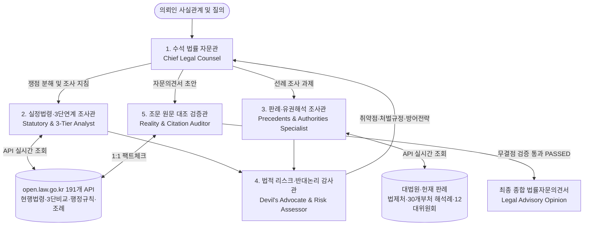

# 대한민국 법제처 open.law.go.kr 기반 5인 전문 법률 검토 에이전트 팀 (`law` 스킬)

대한민국 법제처 국가법령정보 공동활용(`https://open.law.go.kr`)의 191개 공공 법률 API 엔드포인트를 실시간 연동하여, 가짜 조문이나 왜곡된 판례 인용을 원천 차단(Zero-Hallucination)하고 최고 수준의 법률 검토 및 자문의견서(Legal Opinion)를 생성하는 에이전트 팀 스킬입니다.

---

## 1. 5인 전문 법률 에이전트 팀 아키텍처



### 5인 에이전트별 전문 역할:
1. **🏛️ 수석 법률 자문관 (Chief Legal Counsel)**:
   - 의뢰 사실관계(Fact Pattern) 심층 분석 및 2~4대 핵심 법률 쟁점(Fact-to-Issue Mapping) 도출.
   - 각 하위 전문 에이전트의 조사 결과를 유기적으로 엮어 최종 법률자문의견서(Legal Advisory Memo) 총괄 집필.
2. **📜 실정법령·3단연계 조사관 (Statutory & 3-Tier Analyst)**:
   - 최신 현행법령(`eflaw`), 공포법령(`nwlaw`), 법률-시행령-시행규칙 3단 비교(`thdCmp`), 행정규칙(고시/훈령 `admrul`), 지자체 조례·규칙(`ordin`) 실시간 탐색.
   - 최신 개정 연혁 및 부칙 시행일자를 확인하여 현재 법적 효력 보유 여부 확정.
3. **⚖️ 판례·유권해석 조사관 (Precedent & Authority Specialist)**:
   - 대법원 및 각급법원 판례(`prec`), 헌법재판소 결정례(`detc`), 법제처 유권해석례(`expc`), 30개 중앙부처 해석례(`cgmExpc...`), 12대 전문 위원회 결정문(`ppc` 개인정보위, `ftc` 공정위, `nlrc` 노동위 등) 검색.
   - 사안과 가장 일치하는 리딩 케이스(Leading Cases)의 판시사항, 판결요지, 법원의 판단 기준 추출.
4. **😈 법적 리스크·반대논리 감사관 (Devil's Advocate & Risk Assessor)**:
   - 가장 보수적이고 엄격한 시각에서 의뢰인의 법적 취약점 공격.
   - 위반 시 처벌 규정(징역, 벌금), 행정제재(과태료, 영업정지), 입증책임(Burden of Proof) 부존재 위험 분석.
   - 상대방 및 규제기관이 펼칠 수 있는 반대 논리(Counter-arguments)를 선제적으로 예측하고 방어 전략 수립.
5. **🛡️ 조문 원문 대조 검증관 (Reality & Citation Auditor)**:
   - Zero-Hallucination Gatekeeper. 최종 작성된 자문서 내 모든 인용 조문(조·항·호·목)과 판례 사건번호를 `open.law.go.kr` OpenAPI와 1:1 전수 실시간 대조.
   - 존재하지 않는 가짜 조문이나 사건번호 왜곡이 단 1건도 없는 무결점(Verdict: PASSED) 확인 후 자문서 최종 발행.

---

## 2. 즉시 실행 CLI 명령어

스킬 내장 CLI(`law_cli.py`)를 통해 모든 법률 데이터 검색 및 검증을 즉각 실행할 수 있습니다:

```powershell
# 1. 5인 에이전트 팀 법률 검토 및 자문의견서 원스톱 생성 (파일 저장)
python "C:\Users\sdm24\.agents\skills\law\scripts\law_cli.py" review "직원 동의 없는 사무실 CCTV 설치 및 근태관리 활용 적법성 검토" -o "C:\Users\sdm24\legal_cctv_opinion.md"

# 2. 특정 법령의 특정 조문(제N조) 및 항·호·목 전문 즉시 조회
python "C:\Users\sdm24\.agents\skills\law\scripts\law_cli.py" article "근로기준법" 60
python "C:\Users\sdm24\.agents\skills\law\scripts\law_cli.py" article "개인정보 보호법" 15

# 3. 법률-시행령-시행규칙 3단 비교(thdCmp) 즉시 조회
python "C:\Users\sdm24\.agents\skills\law\scripts\law_cli.py" thdcmp "중대재해 처벌 등에 관한 법률"

# 4. 대법원 판례 사건번호 및 판시사항/판결요지 상세 조회
python "C:\Users\sdm24\.agents\skills\law\scripts\law_cli.py" precedent "2023다216777"
python "C:\Users\sdm24\.agents\skills\law\scripts\law_cli.py" search "통상임금" --target prec

# 5. 법제처 유권해석례 조회
python "C:\Users\sdm24\.agents\skills\law\scripts\law_cli.py" interpretation "개인정보"

# 6. 행정규칙(훈령·예규·고시) 및 12대 위원회 결정례 검색
python "C:\Users\sdm24\.agents\skills\law\scripts\law_cli.py" search "CCTV" --target ppc
python "C:\Users\sdm24\.agents\skills\law\scripts\law_cli.py" search "부당노동행위" --target nlrc

# 7. 작성된 법률 문서 내 인용 조문 및 판례 실재 여부 100% 자동 검증
python "C:\Users\sdm24\.agents\skills\law\scripts\law_cli.py" verify "검증할_자문서.md"
```

---

## 3. 6대 전문 검토 모드

| 모드 | 목적 | 주요 산출물 |
| :--- | :--- | :--- |
| **`full` (종합 자문)** | 복잡한 사실관계에 대한 5인 에이전트 종합 법률의견서 도출 | 표준 법률자문의견서 (Legal Opinion Memo) |
| **`statute` (실정법령)** | 특정 행위의 법률-시행령-시행규칙 요건 충족 및 위임 체계 분석 | 3단 비교 및 조문 요건 포섭표 |
| **`precedent` (판례·선례)** | 유사 사안에 대한 대법원·하급심·행정해석 리딩 케이스 추출 | 판례 요지 및 사안 적용 분석서 |
| **`contract` (계약·약관)** | 계약서, 이용약관, 취업규칙 내 독소 조항 및 법률 리스크 진단 | 조항별 수정 권고안(Redline Diff) |
| **`administrative` (행정구제)** | 과태료 부과, 시정명령, 영업정지 등 행정처분 대응 및 이의신청 | 행정심판/소송 대응 및 처분 취소 사유서 |
| **`verify` (무결점 감사)** | 임의 작성된 문서 내 법령 조문, 호목, 판례 사건번호의 실재 여부 검증 | Anti-Hallucination Audit Scorecard |

---

## 4. 무결점 검증 철칙 (Zero-Hallucination Iron Rules)

1. **절대 조문 번호 창작 금지**: 대한민국 실정법에 실제로 존재하지 않는 조문(예: '개인정보보호법 제99조' 등) 인용 절대 불가. 반드시 `law_api.py` 조회 결과에 존재하는 조문만 사용한다.
2. **최신 시행일자 부칙 엄수**: 구법령 조항을 인용할 경우 반드시 개정 연혁과 현재 시행일자를 명시하고 현행 조항으로 교차 검증한다.
3. **판례 사건번호 무결성**: 사건번호(예: `2023다216777`)는 실제 판결 선고 내역과 일치해야 하며, 임의의 연도/부호 조합을 금지한다.
4. **검증 게이트 필수 통과**: 모든 자문의견서 하단에는 `LawCitationVerifier`가 발행한 검증 판정(`Verdict: PASSED`, 신뢰도 `100%`) 리포트가 첨부되어야 한다.
